# Data Flow - Newsworthy Customer 360 Analytics

**Author:** SE Community  
**Last Updated:** 2025-11-25  
**Expires:** 2025-12-20 (30 days from creation)  
**Status:** Reference Implementation

**Reference Implementation:** This code demonstrates production-grade architectural patterns and best practices. Review and customize security, networking, and business logic for your organization's specific requirements before deployment.

## Overview

This diagram shows how subscriber data flows through the Customer 360 system, from multiple source systems through real-time ingestion, staging transformation, ML-powered analytics, and finally to consumption layers including Streamlit dashboards and BI tools.

## Diagram

```mermaid
graph TB
    subgraph Sources["📊 Data Sources"]
        S1[Subscription System<br/>Events API]
        S2[Content Platform<br/>Streaming Views]
        S3[Support System<br/>Batch Tickets]
    end
    
    subgraph Ingestion["🔄 Ingestion Layer<br/>SFE_RAW_MEDIA"]
        SP[Snowpipe Streaming<br/>Real-time]
        CI[COPY INTO<br/>Batch Load]
        ST1[Stream:<br/>sfe_subscriber_events_stream]
        ST2[Stream:<br/>sfe_content_stream]
        R1[(RAW_SUBSCRIBER_EVENTS)]
        R2[(RAW_CONTENT_ENGAGEMENT)]
        R3[(RAW_SUPPORT_INTERACTIONS)]
    end
    
    subgraph Staging["🧹 Staging Layer<br/>SFE_STG_MEDIA"]
        T1[Task: sfe_process_subscribers_task<br/>1 MIN schedule]
        T2[Task: sfe_process_engagement_task<br/>1 MIN schedule]
        ST1_DB[(STG_SUBSCRIBER_EVENTS)]
        ST2_DB[(STG_UNIFIED_CUSTOMER)]
        ST3_DB[(STG_CONTENT_ENGAGEMENT)]
    end
    
    subgraph Analytics["📈 Analytics Layer<br/>SFE_ANALYTICS_MEDIA"]
        DIM[(DIM_SUBSCRIBERS<br/>Enriched Dimension)]
        FCT1[(FCT_ENGAGEMENT_DAILY<br/>Daily Aggregates)]
        FCT2[(FCT_CHURN_TRAINING<br/>ML Training Data)]
        ML[Cortex ML Classification<br/>SFE_CHURN_CLASSIFIER]
        FCT3[(FCT_CUSTOMER_HEALTH_SCORES<br/>Risk Predictions)]
        T3[Task: sfe_daily_churn_scoring_task<br/>DAILY schedule]
    end
    
    subgraph Outputs["🎯 Consumption Layer"]
        DASH[Streamlit Dashboard<br/>SFE_CUSTOMER_360_DASHBOARD]
        BI[BI Tools<br/>Tableau/Power BI]
        API[API Integrations<br/>External Systems]
    end
    
    S1 -->|JSON Events| SP
    S2 -->|CSV Files| SP
    S3 -->|Parquet Files| CI
    
    SP --> R1
    SP --> R2
    CI --> R3
    
    R1 -.->|CDC| ST1
    R2 -.->|CDC| ST2
    
    ST1 -->|WHEN SYSTEM$STREAM_HAS_DATA| T1
    ST2 -->|WHEN SYSTEM$STREAM_HAS_DATA| T2
    
    T1 --> ST1_DB
    T1 --> ST2_DB
    T2 --> ST3_DB
    
    ST2_DB -->|Enrich| DIM
    ST1_DB -->|Daily Rollup| FCT1
    ST3_DB -->|Feature Engineering| FCT2
    R3 -->|Feature Engineering| FCT2
    
    FCT2 -->|Train Weekly| ML
    DIM -->|Predict| T3
    FCT1 -->|Features| T3
    ML -.->|Model| T3
    T3 --> FCT3
    
    DIM --> DASH
    FCT1 --> DASH
    FCT3 --> DASH
    
    DIM --> BI
    FCT1 --> BI
    FCT3 --> BI
    
    FCT3 --> API
    
    classDef sourceStyle fill:#e1f5ff,stroke:#01579b,stroke-width:2px
    classDef rawStyle fill:#fff3e0,stroke:#e65100,stroke-width:2px
    classDef stagingStyle fill:#f3e5f5,stroke:#4a148c,stroke-width:2px
    classDef analyticsStyle fill:#e8f5e9,stroke:#1b5e20,stroke-width:2px
    classDef outputStyle fill:#fce4ec,stroke:#880e4f,stroke-width:2px
    
    class S1,S2,S3 sourceStyle
    class R1,R2,R3,SP,CI,ST1,ST2 rawStyle
    class T1,T2,ST1_DB,ST2_DB,ST3_DB stagingStyle
    class DIM,FCT1,FCT2,FCT3,ML,T3 analyticsStyle
    class DASH,BI,API outputStyle
```

[🎨 Edit in Mermaid Chart Playground](https://mermaidchart.com/play?utm_source=mermaid_mcp_server&utm_medium=remote_server&utm_campaign=cursor#pako:eNqNVktv6kYU_isjblWlktMLdrjNpdKVjHGCKzDI4ySKSGUNZkysODbXM26CSnddVF100-677LLr_qv-hJ7xixmSNEHCYs7jm3O-8zA_dsJsRTuDzjonm1vkD29SBB9WLCsBzoo8pGxx0_n3z99_RSPCSSO76XxfGYsP7i1wsWRhHm94nKUIbxmn918m_Ntl_v6T_QNNOUPm3JFd9IWVpRw0aJ4QHmV5a495Tsl9nK7RZUwfmOxkwD2bTZbzgyuGhIcQfxzeUd440HRV_ThIyknXlIkwy7T--HkvQBOypXkbxpkdeOZVMLVHjqmmO1_gNHvYxBuK2mAbN4-S5JjH91RysJyFNZtfI8f1Z2rIk4ysZGQfmCwRB40di2jAKnKXNA9oSWbASiPFU3_OM6w4fmrv9RZHIjt8McSW5wxtL7AvbdfHX8lGemVkzVwfdIHtnpvn9hR-KlZGAzWfzzw_gCxtz7R8Z-a2aC8VA3OyBvLKUvz1T3N8Wgjsnz9TCGDLJ-xugESqmzyDvmQSWSzgoG1gemjquIiFt3RVJHJ1gLmnKDRdkzW9F9y9CQQqF4yGiyMR6P9yCoVqDS9c58yxR4F1gf3Z1PZUO6O1e5n_l3g1U5JseRzWs_vLXvCUW9M1J9e-Y-FnGB4508URPKSccDvXaR4LItAIuj1lMEBy_GcWVOcInlLUwch0JteN_4jEyRaZ63VO14RTduCtV97W-MJzA98zHddxzxvf6QT5OYlT0SxiLcm-0wmslpzTR_iFrIQwFkdxSMSEy2lXwNbExFhUwVNvN-rb68oEY9uc-OMAWzPPbhnwYnaH5jldxaFAVzIAhH1XrUSqQXhb5GnAwiyHsJW2Knk5bKuXajsr-KbgVWV_-xvBGmXF_Wa_wNQCmnhcL4Yk5sAVu11mJF8pTDRJGh-6gXAYzkxvJIEMncXQQX6WJazx88kyoaR4P88eaA4GkjUs-gV8Ya9yChGXzLQ988hpDq1Y7-8XdjXuoePjT7vv8MxF1dtjB0u31umlzsKX6CxOqKwxSs2c5J8Lyhut5SjIc2ED20896tXRcqqjIbt4EMzX4saRtRNjXkt1Raorl_hV_Fdj20X4Gvv29Avse7Y5DcYmBoZ9c4caIPB9g7GCX8HXK-dApO9Fei0yWlF7I0jKS6sR3okxb0NvdNV4elmSFJtdOc6NidGYnFHCi5wiO4WtTalo69KyjtYz3mJVPcW5tC7HGl1RepdsdzDBlRoCrIpbDRswYrR-PfkWtlfB9JclmsJ_nGQv9suoyhmXA6hvKAdGhVZFxoFI9R46B76SwFAEB2IYGFkeirU1ohFi5d8tzLcJRVGcJIN3tBf1o0iDN3p2Rwfvur3-Nx-X9fH4IV7x24G-eTyAycmDjBFFkUG7LQb90O91u69hsOrlrOAYtB_1W5wT0js5DV_DIc2rSMnqNOrTjy1Sb9mn-qsRZeUmVAIK6QkNW5jT0y49iV6AkcBg42hY12CDSHzLeq-nebrmGRqea5ajwZhoYnAbWmVTUPm6Vg2SVs2aVs-MzKDsAt2jiY4RD108DG060aAzVKoUF2hAbehoYtFKNNyknZ_-A5q9nBQ)

## Data Flow Stages

### Stage 1: Data Sources (External Systems)
**Timing:** Continuous / Real-time

Three distinct source systems generate subscriber data:

1. **Subscription System (Events API)**
   - Event types: signup, upgrade, downgrade, cancel, payment
   - Format: JSON payloads
   - Frequency: Real-time as events occur
   - Volume: ~500-1,000 events/day

2. **Content Platform (Streaming Views)**
   - Metrics: article views, read time, section browsing
   - Format: CSV files from web analytics
   - Frequency: Near real-time (1-minute batches)
   - Volume: ~50,000 engagement events/day

3. **Support System (Batch Tickets)**
   - Data: customer service interactions, ticket resolution
   - Format: Parquet files
   - Frequency: Daily batch at 2 AM
   - Volume: ~100-200 tickets/day

### Stage 2: Ingestion Layer (SFE_RAW_MEDIA)
**Timing:** Real-time ingestion → CDC capture

**Ingestion Methods:**
- **Snowpipe Streaming:** Handles JSON subscription events and CSV content engagement
  - Latency: < 1 second from source to table
  - No file staging required
  - Automatic schema detection

- **COPY INTO:** Loads daily support ticket batches
  - Scheduled: 2:30 AM daily
  - Validates data quality
  - Error handling with reject tables

**Synthetic Data Generation (Demo Mode):**
For demonstration purposes, initial data is generated using Snowflake native functions with statistically realistic distributions:

| Column | Distribution Type | Parameters | Rationale |
|--------|------------------|------------|-----------|
| `payment_amount` | NORMAL | mean=$19.99, stddev=$10 | Clusters around typical subscription price points ($9.99-$49.99) |
| `article_id` | ZIPF | s=1.0, N=1000 | Power-law distribution (80/20 rule) - few viral articles, long tail of rarely-viewed content |
| `time_spent_seconds` | NORMAL | mean=180s, stddev=120s | Bell curve around 3 minutes - realistic reading behavior vs. uniform distribution |
| `subscriber_id` | UUID_STRING | Random v4 | Collision-proof unique identifiers |
| `event_timestamp` | UNIFORM | last 90 days | Evenly distributed across time range |

**Why These Distributions Matter:**
- **NORMAL:** Real-world pricing and engagement cluster around means (not flat)
- **ZIPF:** Media consumption follows power laws (viral content vs. long tail)
- **UNIFORM:** Truly random selection (dates, categories) where all outcomes equally likely

See `sql/02_data/02_load_sample_data.sql` for implementation details.

**Change Data Capture (Streams):**
- `sfe_subscriber_events_stream` → Captures all INSERT operations on RAW_SUBSCRIBER_EVENTS
- `sfe_content_stream` → Captures all INSERT operations on RAW_CONTENT_ENGAGEMENT
- Stream metadata: METADATA$ACTION, METADATA$ISUPDATE, METADATA$ROW_ID

### Stage 3: Staging Layer (SFE_STG_MEDIA)
**Timing:** 1-minute incremental processing

**Task Orchestration:**
1. **sfe_process_subscribers_task**
   - Schedule: Every 1 minute
   - Condition: `WHEN SYSTEM$STREAM_HAS_DATA('sfe_subscriber_events_stream')`
   - Actions:
     * Clean timestamps (validate, timezone conversion)
     * Flag invalid events (is_valid = FALSE)
     * Deduplicate subscribers → STG_UNIFIED_CUSTOMER
     * MERGE into STG_SUBSCRIBER_EVENTS

2. **sfe_process_engagement_task**
   - Schedule: Every 1 minute
   - Condition: `WHEN SYSTEM$STREAM_HAS_DATA('sfe_content_stream')`
   - Actions:
     * Parse article metadata
     * Calculate engagement scores
     * Filter bot traffic
     * INSERT into STG_CONTENT_ENGAGEMENT

**Data Transformations:**
- Type casting (VARCHAR → TIMESTAMP_NTZ)
- Null handling (default values for missing fields)
- Business rule validation (payment_amount > 0)
- Deduplication logic (latest record wins by event_timestamp)

### Stage 4: Analytics Layer (SFE_ANALYTICS_MEDIA)
**Timing:** Daily batch processing (3 AM) + Weekly ML training

**Dimension Building:**
- `DIM_SUBSCRIBERS` refreshed daily
  - Calculates tenure_days (CURRENT_DATE - signup_date)
  - Computes lifetime_value from payment history
  - Enriches with demographic_segment (manual mapping)

**Fact Aggregation:**
- `FCT_ENGAGEMENT_DAILY` refreshed daily
  - Aggregates STG_CONTENT_ENGAGEMENT by subscriber_id + date
  - Metrics: articles_viewed, total_time_spent, distinct_sections

**ML Training:**
- `FCT_CHURN_TRAINING` refreshed weekly (Sunday 1 AM)
  - Feature engineering:
    * engagement_score (avg daily engagement last 30 days)
    * support_tickets_count (last 90 days)
    * days_since_last_read (recency metric)
    * subscription_tenure_days (lifecycle stage)
  - Label: churned (canceled subscription in next 30 days)
  - Train/test split: 80/20 by date
  - Used by SFE_CHURN_CLASSIFIER model

**ML Prediction:**
- `sfe_daily_churn_scoring_task` runs daily (4 AM)
  - Calls `SFE_CHURN_CLASSIFIER!PREDICT()`
  - Inputs: DIM_SUBSCRIBERS + FCT_ENGAGEMENT_DAILY (last 30 days)
  - Outputs: churn_risk_score (0.0-1.0), risk_tier (High/Medium/Low)
  - Inserts predictions into FCT_CUSTOMER_HEALTH_SCORES

### Stage 5: Consumption Layer
**Timing:** On-demand queries

**Streamlit Dashboard (SFE_CUSTOMER_360_DASHBOARD):**
- Queries: DIM_SUBSCRIBERS, FCT_ENGAGEMENT_DAILY, FCT_CUSTOMER_HEALTH_SCORES
- Features:
  * Subscriber 360 profile view
  * Churn risk leaderboard
  * Engagement trends over time
  * Cohort analysis
- Refresh: Real-time (query on page load)

**BI Tools Integration:**
- Direct SQL access to analytics tables
- Optimized for aggregation queries
- Materialized views for common dashboards

**API Integrations:**
- FCT_CUSTOMER_HEALTH_SCORES → External marketing automation
- REST API exposes churn predictions for CRM systems

## Data Format Transformations

| Stage | Input Format | Output Format | Transformation |
|-------|-------------|---------------|----------------|
| Sources → Ingestion | JSON, CSV, Parquet | Snowflake VARIANT/VARCHAR | Schema-on-read, type inference |
| Ingestion → Staging | Raw strings/VARIANT | Typed columns (TIMESTAMP, NUMBER) | CAST, TRY_CAST, validation |
| Staging → Analytics (Facts) | Row-level events | Aggregated daily metrics | GROUP BY, window functions |
| Staging → Analytics (ML) | Normalized tables | Denormalized feature table | JOINs, feature engineering |
| Analytics → Prediction | Feature table | Prediction scores | Cortex ML Classification |
| Analytics → Dashboard | Tables | Interactive visualizations | Streamlit SQL queries |

## Performance Characteristics

### Latency
| Path | Latency | SLA |
|------|---------|-----|
| Subscription event → STG_UNIFIED_CUSTOMER | < 2 minutes | 5 minutes |
| Content view → STG_CONTENT_ENGAGEMENT | < 2 minutes | 5 minutes |
| Daily facts refresh | Completes by 3:30 AM | 4:00 AM |
| Churn prediction refresh | Completes by 4:30 AM | 5:00 AM |
| Dashboard query response | < 2 seconds | 5 seconds |

### Data Freshness
- **Real-time data:** Subscriber events, content engagement (< 2 min delay)
- **Daily data:** Engagement aggregates, churn predictions (refreshed 3-4 AM)
- **Weekly data:** ML model retraining (Sunday 1 AM)

### Throughput
- Ingestion: 50,000 events/day sustained, 100,000/day burst capacity
- Staging: Processes 1,000 events/minute per task
- Analytics: Aggregates 500K rows in < 5 minutes

## Error Handling & Data Quality

### Ingestion Errors
- Malformed JSON → Logged to error table, alerting enabled
- Schema drift → Auto-adapt for backward-compatible changes
- Duplicate detection → Deduplicate by natural key in staging

### Staging Validation
- Invalid timestamps → Flagged with is_valid = FALSE, not propagated
- Missing required fields → Default values applied where safe
- Referential integrity → Orphaned records logged but processed

### Analytics Quality Checks
- Pre-aggregation: Row counts, null percentages, value ranges
- Post-aggregation: Metric reasonableness (e.g., engagement_score 0-100)
- ML predictions: Confidence thresholds (only deploy if model AUC > 0.80)

## Change History

See `.cursor/DIAGRAM_CHANGELOG.md` for version history.

