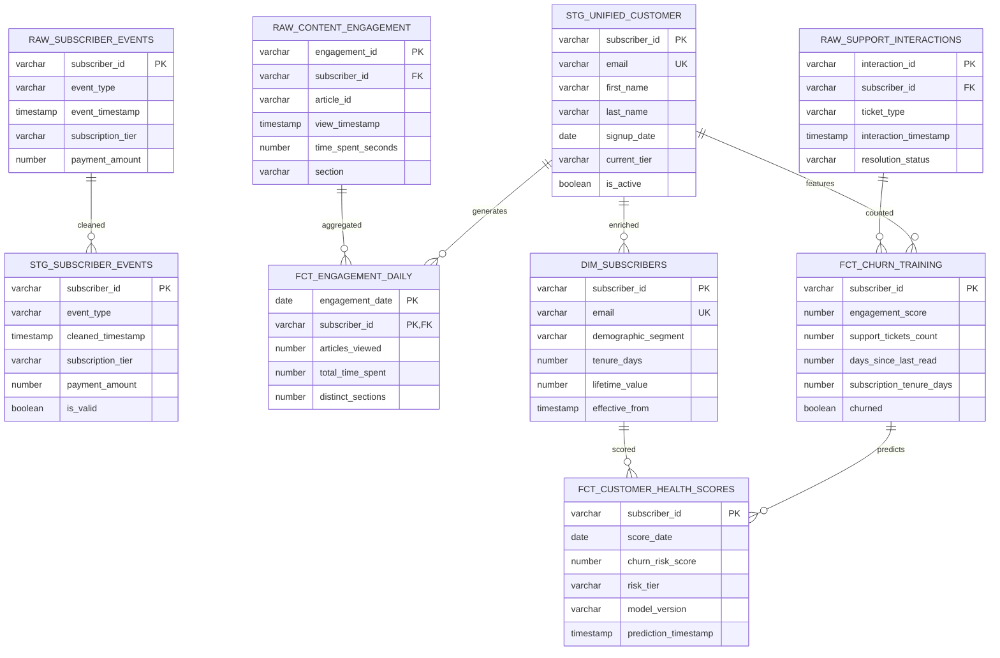

# Data Model - Newsworthy Customer 360 Analytics

**Author:** Snowflake Solutions Engineering  
**Last Updated:** 2025-11-20  
**Status:** Reference Implementation


**Reference Implementation:** This code demonstrates production-grade architectural patterns and best practices. Review and customize security, networking, and business logic for your organization's specific requirements before deployment.

## Overview

This diagram shows the complete data model for the Customer 360 media analytics system, spanning three schemas (Raw, Staging, Analytics) with relationships showing data flow from ingestion through ML-powered churn prediction.

## Diagram



[🎨 Edit in Mermaid Chart Playground](https://mermaidchart.com/play?utm_source=mermaid_mcp_server&utm_medium=remote_server&utm_campaign=cursor#pako:eNq1lttuozAQhl8F5Xr7Ar3LEpqitiQCsquVKlmumRCrYCMbsqrSvvuOORQCpid1uUCQGX7PZ88hpwWTCSwuF6BWnKaK5vfCwStc_ibR7mfkhv5PLyTeLy-II-f5-eJCnpwoXluMl879gmVABST3i17F3QQx2okXrJdr7w4fO5krd_grWS392z-1Ck1TBSktz4Wi3Xa7CWPio164dGN_E0RDKfd6FwYkDpd-4AfrJhxZiYFKczfR7wL_yvdWxN1F8ebOCzudlX83IGuYQCjODr3KW9_PIqUgQCGR_qiKhWYPtKxUL9HcxyEPNVpdcu0tb-NrErmb0GugNJOqR7Is-DGZAkU4K0ch2ZPn1BjNdaSKHahydPWgmeIPoAhPnO3N1AOOIEpSPhXQ20qegy5pXnTW7n12gaLkUqAfqN5FVDmu6xT0KTciNDe50phfxjCWHLbQgEhpCrXaDM0575XFg6qSYxGh2cZ75PDXhtuyGAvRhQlAA5Mi0ZYQgJnNmAG11pgFlWNZKVorfZ0VSR9h_nCHa7xxxFgQMqtqL_QoK21Bszes_5CQbf_7_pQ014OURt7hmhxp1mXIy7u97WucOeWZs7NY9lzpkgiaw9SW0Ykpwa7naJ6KqiDmefoRq5Rq6ni4GQNakwRHsOCOe983kyaQSxyJxYEzLKjUHMq05kBgT0ayJz2xZXwPdU3icVX2BrbfQw1H9krmFkLrQDmNdnfQeOr398txe_NjWJFtvG3zwfTCPgPJlFWWNCN9l5k4JFyXXLC6_Zj81jNEo1nzqWNrlxow17Ns4qCropDKZJXpMpqw82LqIsZzIxpjBlLnrgKaWKSGJWs78C5Z2aFSApI5bPsg_RR-U06GeFRNbax1BERx_Tjel9eGaWzntdaZcvwvmJEjKP06Is7ztZ33lpaMsIuXf9JQPZo)

## Schema Layers

### SFE_RAW_MEDIA (Raw Landing Layer)
- **Purpose:** Ingest unmodified data from source systems
- **Technology:** Snowflake tables with Streams for CDC
- **Location:** `SNOWFLAKE_EXAMPLE.SFE_RAW_MEDIA`
- **Dependencies:** Source system data feeds

**Tables:**
1. `RAW_SUBSCRIBER_EVENTS` - Subscription lifecycle events (signup, upgrade, cancel)
2. `RAW_CONTENT_ENGAGEMENT` - Article views and reading behavior
3. `RAW_SUPPORT_INTERACTIONS` - Customer service ticket history

### SFE_STG_MEDIA (Staging/Cleaning Layer)
- **Purpose:** Clean, validate, and deduplicate raw data
- **Technology:** Snowflake tables populated via Tasks
- **Location:** `SNOWFLAKE_EXAMPLE.SFE_STG_MEDIA`
- **Dependencies:** RAW_* tables

**Tables:**
1. `STG_SUBSCRIBER_EVENTS` - Cleaned subscription events with validation flags
2. `STG_UNIFIED_CUSTOMER` - Deduplicated subscriber master (single source of truth)

### SFE_ANALYTICS_MEDIA (Analytics Layer)
- **Purpose:** Business-ready dimensional model and ML predictions
- **Technology:** Dimensional model + Cortex ML Classification
- **Location:** `SNOWFLAKE_EXAMPLE.SFE_ANALYTICS_MEDIA`
- **Dependencies:** STG_* tables

**Dimensions:**
1. `DIM_SUBSCRIBERS` - Subscriber dimension with demographics and tenure

**Facts:**
1. `FCT_ENGAGEMENT_DAILY` - Daily engagement metrics per subscriber
2. `FCT_CHURN_TRAINING` - Training dataset for churn prediction model
3. `FCT_CUSTOMER_HEALTH_SCORES` - Daily churn risk predictions from ML model

## Component Descriptions

### RAW_SUBSCRIBER_EVENTS
- **Purpose:** Landing zone for subscription events
- **Technology:** Snowflake table with Stream
- **Location:** `sql/02_data/01_create_tables.sql`
- **Dependencies:** External data feed (simulated with GENERATOR)
- **Stream:** `sfe_subscriber_events_stream` captures all changes

### RAW_CONTENT_ENGAGEMENT
- **Purpose:** Captures article reading behavior
- **Technology:** Snowflake table with Stream
- **Location:** `sql/02_data/01_create_tables.sql`
- **Dependencies:** External content tracking system
- **Stream:** `sfe_content_stream` for incremental processing

### STG_UNIFIED_CUSTOMER
- **Purpose:** Golden record for subscriber information
- **Technology:** Type 1 SCD (current state only)
- **Location:** `sql/02_data/01_create_tables.sql`
- **Dependencies:** RAW_SUBSCRIBER_EVENTS via Task processing

### DIM_SUBSCRIBERS
- **Purpose:** Enriched subscriber dimension with calculated fields
- **Technology:** Dimensional table with tenure and LTV calculations
- **Location:** `sql/02_data/01_create_tables.sql`
- **Dependencies:** STG_UNIFIED_CUSTOMER, FCT_ENGAGEMENT_DAILY

### FCT_CHURN_TRAINING
- **Purpose:** Feature engineered dataset for ML model training
- **Technology:** Denormalized fact table with labels
- **Location:** `sql/02_data/01_create_tables.sql`
- **Dependencies:** STG_UNIFIED_CUSTOMER, FCT_ENGAGEMENT_DAILY, RAW_SUPPORT_INTERACTIONS
- **Refresh:** Daily via Task

### FCT_CUSTOMER_HEALTH_SCORES
- **Purpose:** Production churn risk predictions
- **Technology:** ML predictions via Cortex Classification
- **Location:** `sql/04_cortex/02_daily_scoring.sql`
- **Dependencies:** SFE_CHURN_CLASSIFIER model, DIM_SUBSCRIBERS
- **Refresh:** Daily via Task (sfe_daily_churn_scoring_task)

## Relationships

### Data Lineage Flow
```
RAW_SUBSCRIBER_EVENTS → STG_SUBSCRIBER_EVENTS → STG_UNIFIED_CUSTOMER → DIM_SUBSCRIBERS → FCT_CUSTOMER_HEALTH_SCORES
RAW_CONTENT_ENGAGEMENT → FCT_ENGAGEMENT_DAILY ───────────────────────────┘                        ↑
RAW_SUPPORT_INTERACTIONS → FCT_CHURN_TRAINING ───────────────────────────────────────────────────┘
                                    ↓
                        (Used to train SFE_CHURN_CLASSIFIER model)
```

### Key Relationships
1. **subscriber_id** - Primary key across all tables, joins entire model
2. **cleaned → enriched** - Raw tables transform through staging to analytics
3. **aggregated** - Content engagement rolls up to daily facts
4. **predicts** - Training data generates model, model scores customer health

## Table Statistics (Demo Data)

| Table | Row Count | Update Frequency | Retention |
|-------|-----------|------------------|-----------|
| RAW_SUBSCRIBER_EVENTS | 50,000 | Real-time (Stream) | 90 days |
| RAW_CONTENT_ENGAGEMENT | 500,000 | Real-time (Stream) | 30 days |
| RAW_SUPPORT_INTERACTIONS | 12,000 | Daily batch | 1 year |
| STG_UNIFIED_CUSTOMER | 25,000 | Every 1 minute (Task) | Current only |
| DIM_SUBSCRIBERS | 25,000 | Daily (Task) | Current only |
| FCT_ENGAGEMENT_DAILY | 750,000 | Daily (Task) | 1 year |
| FCT_CHURN_TRAINING | 25,000 | Weekly | 6 months |
| FCT_CUSTOMER_HEALTH_SCORES | 25,000 | Daily (Task) | 90 days |

## Data Types & Constraints

### Primary Keys
- All tables have enforced primary keys for data quality
- subscriber_id is VARCHAR(36) UUID format across all tables

### Foreign Keys
- Not enforced in Snowflake (for performance)
- Documented here for logical relationships
- Validated in application logic and Tasks

### Unique Constraints
- email in STG_UNIFIED_CUSTOMER and DIM_SUBSCRIBERS (business key)
- engagement_id in RAW_CONTENT_ENGAGEMENT (natural key)

### Data Validation
- is_valid flag in STG_SUBSCRIBER_EVENTS filters bad data
- churned boolean in FCT_CHURN_TRAINING is label for supervised learning
- risk_tier in FCT_CUSTOMER_HEALTH_SCORES categorizes predictions (High/Medium/Low)

## Change History

See `.cursor/DIAGRAM_CHANGELOG.md` for version history.

