# Network Flow - Newsworthy Customer 360 Analytics

**Author:** SE Community  
**Last Updated:** 2025-11-25  
**Expires:** 2025-12-20 (30 days from creation)  
**Status:** Reference Implementation


**Reference Implementation:** This code demonstrates production-grade architectural patterns and best practices. Review and customize security, networking, and business logic for your organization's specific requirements before deployment.

## Overview

This diagram shows the network architecture for the Customer 360 system, detailing how external systems connect to Snowflake, internal data flow between schemas, and consumption layer access patterns.

## Diagram

```mermaid
graph TB
    subgraph External["🌐 External Systems"]
        USER[End Users<br/>Analysts & Business Users]
        SRC[Source Systems<br/>Subscription/Content/Support]
        BI[BI Tools<br/>Tableau/Power BI]
    end
    
    subgraph Snowflake["❄️ Snowflake Account<br/>account.snowflakecomputing.com"]
        
        subgraph GitInt["GitHub Integration"]
            API_INT[API Integration<br/>SFE_NEWSWORTHY_GIT_INTEGRATION]
            GIT_REPO[Git Repository Stage<br/>newsworthy repo]
        end
        
        subgraph Compute["Compute Layer"]
            WH[Warehouse<br/>SFE_NEWSWORTHY_WH<br/>XSMALL]
        end
        
        subgraph Storage["Storage Layer - SNOWFLAKE_EXAMPLE"]
            RAW[SFE_RAW_MEDIA<br/>3 tables, 2 streams]
            STG[SFE_STG_MEDIA<br/>3 tables]
            ANALYTICS[SFE_ANALYTICS_MEDIA<br/>4 tables, 1 model, 3 tasks]
            STREAMLIT[SFE_STREAMLIT_APPS<br/>1 Streamlit app]
        end
    end
    
    subgraph GitHub["🔗 External Git"]
        GITHUB[github.com/sfc-gh-miwhitaker/newsworthy]
    end
    
    USER -->|HTTPS<br/>OAuth/Key-Pair| STREAMLIT
    SRC -->|HTTPS<br/>Snowpipe Streaming API| RAW
    BI -->|ODBC/JDBC<br/>Port 443| ANALYTICS
    
    GITHUB -->|HTTPS<br/>READ access| API_INT
    API_INT -->|Clone| GIT_REPO
    GIT_REPO -.->|EXECUTE IMMEDIATE FROM| Storage
    
    WH -->|Execute Queries| Storage
    
    RAW -->|Streams + Tasks| STG
    STG -->|Daily Tasks| ANALYTICS
    ANALYTICS -->|Query| STREAMLIT
    
    classDef externalStyle fill:#e3f2fd,stroke:#1565c0,stroke-width:2px
    classDef snowflakeStyle fill:#e8f5e9,stroke:#2e7d32,stroke-width:2px
    classDef storageStyle fill:#fff3e0,stroke:#e65100,stroke-width:2px
    classDef computeStyle fill:#fce4ec,stroke:#880e4f,stroke-width:2px
    
    class USER,SRC,BI,GITHUB externalStyle
    class Snowflake,GitInt snowflakeStyle
    class RAW,STG,ANALYTICS,STREAMLIT storageStyle
    class WH,Compute computeStyle
```



## Component Descriptions

### External Systems

**End Users**
- **Access Method:** HTTPS (port 443) via Snowsight or Streamlit
- **Authentication:** Snowflake OAuth or key-pair auth
- **Network Path:** Internet → Snowflake Edge → Streamlit App
- **Typical Users:** Data analysts, business intelligence teams, customer success managers

**Source Systems**
- **Access Method:** HTTPS Snowpipe Streaming API (port 443)
- **Authentication:** JWT tokens for API access
- **Data Transfer:** TLS 1.2+ encrypted
- **Firewall Requirements:** Outbound HTTPS to `*.snowflakecomputing.com`

**BI Tools**
- **Access Method:** ODBC/JDBC drivers (port 443)
- **Authentication:** Username/password or key-pair
- **Network Path:** Direct SQL queries to analytics schema
- **Typical Tools:** Tableau, Power BI, Looker, Mode

### Snowflake Components

**API Integration (SFE_NEWSWORTHY_GIT_INTEGRATION)**
- **Purpose:** Secure connection to GitHub repository
- **Protocol:** HTTPS with GitHub PAT authentication
- **Allowed Prefixes:** `https://github.com/sfc-gh-miwhitaker/`
- **Network Policy:** None (public GitHub access)
- **Location:** Account-level object

**Git Repository Stage**
- **Purpose:** Cloned GitHub repo as Snowflake stage
- **Origin:** https://github.com/sfc-gh-miwhitaker/newsworthy.git
- **Branch:** main
- **Refresh:** On-demand via ALTER GIT REPOSITORY FETCH
- **Usage:** `EXECUTE IMMEDIATE FROM @repo/branches/main/sql/...`

**Warehouse (SFE_NEWSWORTHY_WH)**
- **Size:** XSMALL (16 credits/hour)
- **Auto-suspend:** 60 seconds
- **Auto-resume:** Enabled
- **Query Routing:** All demo queries
- **Network Access:** Internal Snowflake network only

**Storage Schemas**
- **Network Isolation:** All within Snowflake account boundary
- **Cross-schema Access:** Via USAGE grants
- **External Access:** None (schemas are not externally accessible)
- **Data Transfer:** In-memory within Snowflake

**Streamlit App**
- **Access URL:** https://<account>.snowflakecomputing.com/streamlit/SFE_CUSTOMER_360_DASHBOARD
- **Query Warehouse:** SFE_NEWSWORTHY_WH
- **Session Context:** User's role and warehouse
- **Network:** Runs within Snowflake (no external hosting)

### GitHub Integration

**GitHub Repository**
- **URL:** https://github.com/sfc-gh-miwhitaker/newsworthy
- **Visibility:** Public repository
- **Authentication:** None required for public repos (or PAT for private)
- **Content:** SQL deployment scripts, Streamlit app code, documentation

## Network Paths

### Deployment Flow (One-time)
```
Developer Workstation
    ↓ (git push)
GitHub Repository
    ↓ (HTTPS, READ)
API Integration (SFE_NEWSWORTHY_GIT_INTEGRATION)
    ↓ (internal)
Git Repository Stage
    ↓ (EXECUTE IMMEDIATE FROM)
SFE_NEWSWORTHY_WH
    ↓ (DDL execution)
Schemas (RAW, STG, ANALYTICS, STREAMLIT)
```

### Real-time Data Ingestion Flow
```
Source Systems
    ↓ (HTTPS, Snowpipe Streaming API)
Snowflake Ingest API (port 443)
    ↓ (internal write)
RAW_SUBSCRIBER_EVENTS / RAW_CONTENT_ENGAGEMENT
    ↓ (Stream CDC)
Staging Tasks (triggered by stream)
    ↓ (MERGE statements)
STG_UNIFIED_CUSTOMER / STG_CONTENT_ENGAGEMENT
```

### Batch Analytics Flow
```
Daily Task Scheduler (Snowflake internal)
    ↓ (scheduled trigger)
SFE_NEWSWORTHY_WH
    ↓ (execute SQL)
Analytics Tables (DIM_SUBSCRIBERS, FCT_ENGAGEMENT_DAILY)
    ↓ (ML training/prediction)
Cortex ML Classification
    ↓ (write predictions)
FCT_CUSTOMER_HEALTH_SCORES
```

### Dashboard Query Flow
```
End User Browser
    ↓ (HTTPS, OAuth)
Snowsight → Streamlit App
    ↓ (session.sql())
SFE_NEWSWORTHY_WH
    ↓ (SELECT queries)
Analytics Schema (DIM_SUBSCRIBERS, FCT_CUSTOMER_HEALTH_SCORES)
    ↓ (result set)
Streamlit UI (rendered in browser)
```

## Security & Network Policies

### Authentication Methods
| Component | Method | Credential Storage |
|-----------|--------|-------------------|
| End Users | OAuth 2.0 or Key-Pair | Snowflake internal |
| Source Systems | JWT tokens | Secrets manager |
| BI Tools | Username/Password or Key-Pair | Tool-specific vaults |
| GitHub Integration | Personal Access Token (PAT) | Snowflake SECRET object |

### Network Security
- **TLS Encryption:** All traffic uses TLS 1.2+ (including Snowpipe Streaming)
- **IP Allowlists:** Not configured in this demo (optional for production)
- **Private Link:** Not configured (uses public Snowflake endpoints)
- **VPN Requirements:** None (all access via public internet with TLS)

### Firewall Requirements
**Outbound (from Source Systems to Snowflake):**
- `*.snowflakecomputing.com:443` (HTTPS)
- `*.snowflakecomputing.com:443` (Snowpipe Streaming API)

**Inbound (from End Users to Snowflake):**
- `<account>.snowflakecomputing.com:443` (HTTPS web UI)

**No inbound firewall rules required** - all initiated from client side.

### Data Residency
- **Snowflake Region:** Based on account configuration
- **Data Storage:** All data remains within Snowflake account
- **GitHub Repository:** Code only (no data stored in GitHub)

## Ports & Protocols

| Protocol | Port | Purpose | Encryption |
|----------|------|---------|------------|
| HTTPS | 443 | Snowsight web UI | TLS 1.2+ |
| HTTPS | 443 | Snowpipe Streaming API | TLS 1.2+ |
| HTTPS | 443 | ODBC/JDBC connections | TLS 1.2+ |
| HTTPS | 443 | GitHub API (for git integration) | TLS 1.2+ |

**No custom ports required** - all traffic over standard HTTPS (443).

## High Availability & Failover

This demo configuration uses:
- **Single Warehouse:** XSMALL (no multi-cluster)
- **Single Region:** No cross-region replication
- **No Failover:** Relies on Snowflake platform availability (99.9% SLA)

**For Production:**
- Enable multi-cluster warehouses for query concurrency
- Configure cross-region replication for disaster recovery
- Implement client-side retry logic for transient failures

## Troubleshooting Common Network Issues

### Issue: "Unable to connect to Snowflake"
- **Check:** Firewall allows outbound HTTPS (443) to `*.snowflakecomputing.com`
- **Check:** Corporate proxy not blocking Snowflake domains
- **Check:** Account URL is correct (`<account>.snowflakecomputing.com`)

### Issue: "Snowpipe Streaming API timeouts"
- **Check:** Source system has stable internet connection
- **Check:** JWT token is valid and not expired
- **Check:** API rate limits not exceeded (1,000 requests/min default)

### Issue: "Git repository fetch fails"
- **Check:** API Integration allowed prefixes include GitHub URL
- **Check:** GitHub repository is public OR secret contains valid PAT
- **Check:** No GitHub service disruptions

### Issue: "Streamlit app slow to load"
- **Check:** Warehouse is running (not suspended)
- **Check:** Query warehouse size appropriate for data volume
- **Check:** Queries hitting table clusters efficiently

## Change History

See `.cursor/DIAGRAM_CHANGELOG.md` for version history.

